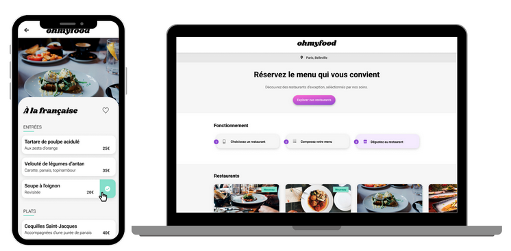

Formation OpenClassRooms.

Projet n°4 : Ohmyfood - Améliorez l'interface d'un site mobile avec des animations CSS

Description

OhMyFood est une plateforme web innovante qui répertorie les menus de restaurants gastronomiques à Paris. Les clients peuvent non seulement consulter les menus, mais aussi composer leur repas à l'avance pour éviter les temps d'attente au restaurant.

Ce projet a été développé en suivant le principe du "mobile first" pour garantir une expérience utilisateur optimale sur tous les appareils, y compris mobiles, tablettes et desktops. Il intègre également des animations pour rendre l'expérience utilisateur plus dynamique et engageante.
Maquettes et Prototype

Les maquettes mobile et desktop du site, ainsi que le prototype complet, sont disponibles sur Figma. Vous pouvez les consulter pour avoir une meilleure compréhension visuelle du projet.
Technologies Utilisées

    HTML5
    CSS3
    SASS
    Figma (Pour le prototype)

Fonctionnalités Principales

    Consultation des menus de restaurants gastronomiques.
    Composition du menu à l'avance.
    Système de réservation en ligne.
    Interface responsive pour une expérience optimale sur tous les appareils.
    Animations interactives pour une expérience utilisateur engageante.

Nous espérons que vous apprécierez l'expérience OhMyFood !

Bonne utilisation et bon appétit !

